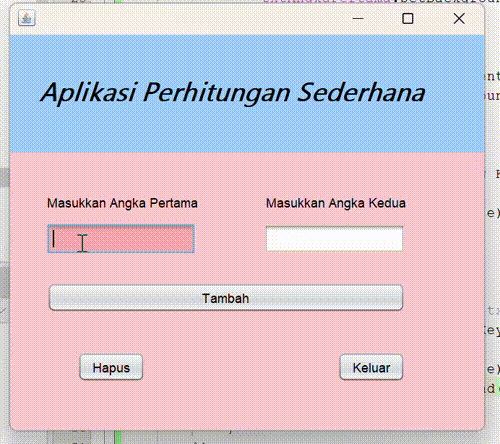

# Aplikasi Pertambahan  
**Latihan 1 - Nama Anda**

---

## Deskripsi Aplikasi  

**Aplikasi Pertambahan** adalah aplikasi berbasis Java sederhana yang digunakan untuk menghitung hasil penjumlahan dua bilangan bulat. Aplikasi ini dirancang menggunakan Java Swing dan menyediakan antarmuka yang sederhana serta mudah digunakan.

---

## Fitur Utama  

1. **Penjumlahan Dua Bilangan**  
   - Pengguna dapat memasukkan dua angka, dan aplikasi akan menghitung hasil penjumlahannya.

2. **Validasi Input**  
   - Aplikasi memastikan hanya angka yang dapat dimasukkan. Jika input tidak valid, aplikasi akan menampilkan pesan kesalahan.

3. **Penghapusan Input**  
   - Fitur untuk menghapus nilai yang telah dimasukkan sehingga pengguna dapat memulai perhitungan baru.

4. **Keluar dari Aplikasi**  
   - Menyediakan tombol keluar dengan konfirmasi untuk memastikan pengguna tidak sengaja menutup aplikasi.

5. **Antarmuka Sederhana**  
   - Menggunakan elemen GUI seperti `JTextField`, `JButton`, dan `JPanel` dengan warna dan tata letak yang mudah dipahami.

---

## Cara Menggunakan Aplikasi  

1. Jalankan aplikasi menggunakan Java Runtime Environment.  
2. Masukkan angka pada kolom **Angka Pertama** dan **Angka Kedua**.  
3. Klik tombol **Tambah** untuk menghitung hasil penjumlahan.  
4. Hasil akan ditampilkan dalam sebuah kotak dialog.  
5. Gunakan tombol **Hapus** untuk membersihkan input.  
6. Klik tombol **Keluar** untuk menutup aplikasi (dengan konfirmasi).

---

## Struktur Aplikasi  

### Validasi Input  
Aplikasi memvalidasi input untuk memastikan bahwa hanya angka yang dapat dimasukkan pada kolom input. Input non-numerik akan ditolak secara otomatis.

### Fungsi Tombol  
- **Tambah**: Menghitung hasil penjumlahan dari dua angka yang dimasukkan pengguna.  
- **Hapus**: Membersihkan semua input yang telah dimasukkan.  
- **Keluar**: Menutup aplikasi setelah meminta konfirmasi dari pengguna.

### Antarmuka Pengguna  
Dibangun menggunakan Java Swing dengan elemen-elemen GUI seperti `JTextField`, `JButton`, `JPanel`, dan `JLabel`.

---

## Tampilan Aplikasi  

### Gambar Tampilan Utama Aplikasi  

## Pembuat Aplikasi  

- **Nama**:[Siti Aisyah Nor Fitriani]  
- **NPM**: [2210010043]  
- **Tugas**: Latihan 1  

---

## Catatan  
- Aplikasi ini dirancang untuk kebutuhan belajar dan dapat dikembangkan lebih lanjut sesuai kebutuhan Anda.
